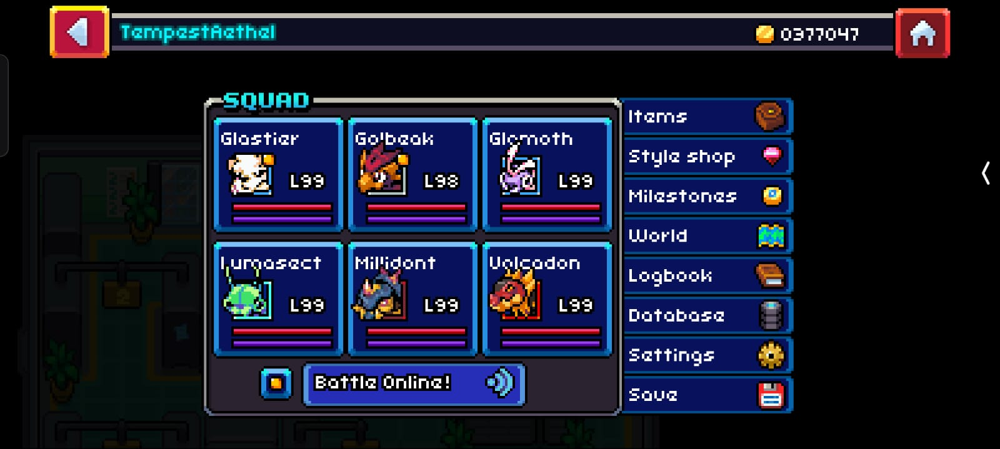
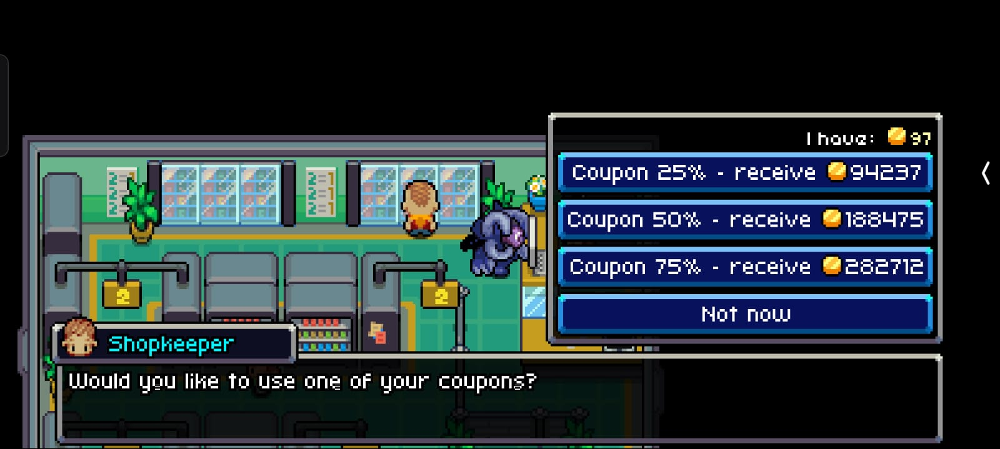
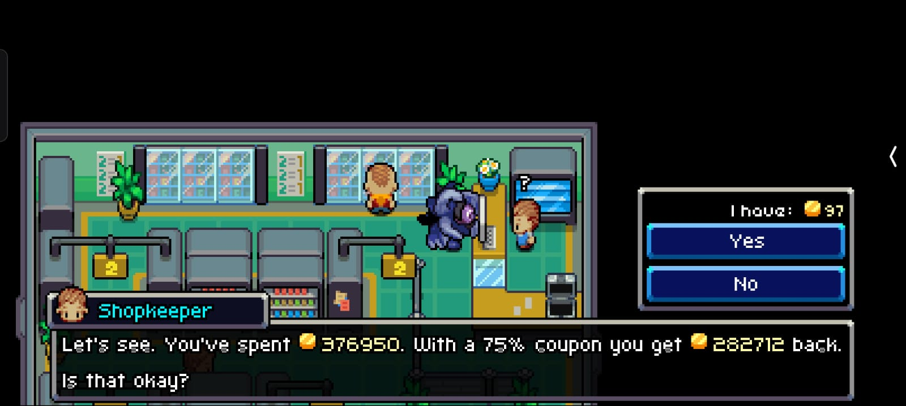

# **Coromon: Best Use of Coins Guide**

Managing your coins efficiently in *Coromon* can significantly enhance your gameplay. This guide explains how to use coins for maximum benefits, based on a step-by-step strategy that includes upgrading your gear, utilizing discounts, and stocking essential items.

---

## **Step 1: Maximize Upgrades**

First, focus on fully upgrading your build. Prioritize upgrades that boost your combat performance and enhance item acquisition, such as:

- **Gear Upgrades**: Ensure your weapons, armor, and utilities are maxed out.
- **Core Facilities**: Invest in expanding your item-carrying capacity or healing efficiency.

### **Screenshot**

The screenshot above shows my current build, which is fully maxed out.

---

## **Step 2: Sell Non-Essential Items**

To gather coins efficiently, sell off all non-essential items, such as low-tier spinners and potions. Retain only the following:

- **Platinum Spinners** (useful for capturing high-tier Coromon).
- **Gems** (critical for crafting and trading).
- **Potentiflator Tokens** (used for upgrading potential).

By doing this, you can consolidate your funds to purchase essential resources in bulk later.

---

## **Step 3: Buying Items in Bulk with Discounts**

Once you’ve gathered enough coins, find an opportunity to purchase high-value items in bulk. Utilize discounts to save a significant amount of money.

- **Bulk Purchase Discounts**: Look for stores offering up to 75% off on bulk purchases.
- **Prioritize**: Focus on restocking healing items, powerful spinners, and high-tier potions.

### **Screenshot**

The screenshot above shows my purchase screen after using my savings to buy everything in bulk.

---

## **Step 4: Applying Discounts**

Before finalizing your purchase, apply any available discounts. For this step, I used a **75% discount**, which allowed me to maximize my spending and stock up on essential supplies.

### **Screenshot**

The screenshot above shows the purchase screen after successfully applying the discount.

---

## **Key Takeaways**

1. **Upgrade Wisely**: Max out your build first before focusing on item purchases.
2. **Sell Non-Essentials**: Gather coins by selling unused or low-value items.
3. **Buy in Bulk**: Always use discounts to make the most of your coins.
4. **Retain Essentials**: Keep high-tier items like Platinum Spinners and gems for long-term benefits.
