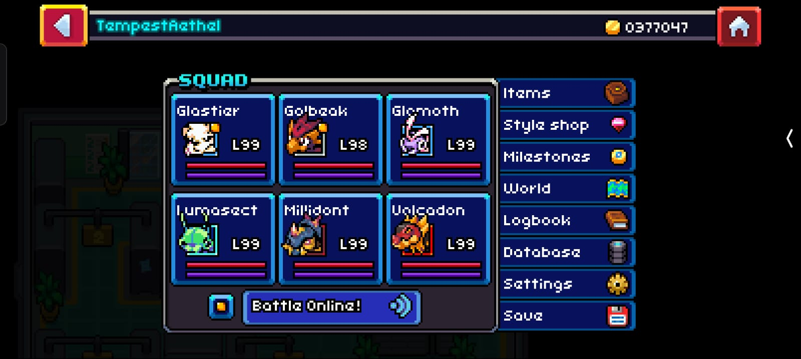
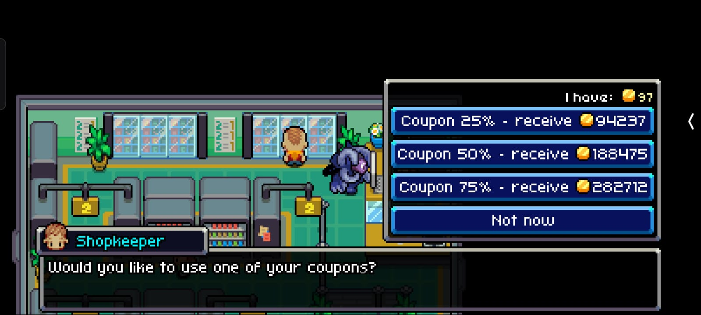
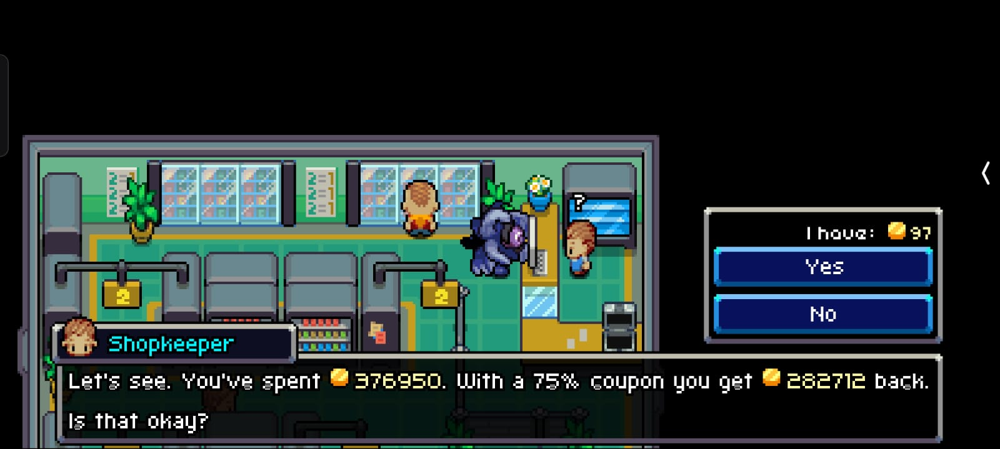

> Note:I was a bit rushed when putting this together, so I included everything I felt was relevant, along with what the language model provided. I didn’t thoroughly verify it for potential AI-generated inaccuracies (hallucinations). For the most accurate and up-to-date information, please refer to the PDF.

# **Table of Contents**

1. [Best Use of Coins Guide](#coromon-best-use-of-coins-guide)

   * [Maximize Upgrades](#step-1-maximize-upgrades)
   * [Sell Non-Essentials](#step-2-sell-non-essential-items)
   * [Buy in Bulk](#step-3-buying-items-in-bulk-with-discounts)
   * [Apply Discounts](#step-4-applying-discounts)
   * [Key Takeaways](#key-takeaways)

2. [All Coupon Locations](#coromon-all-coupon-locations)

   * [Shop Discounts](#1-shop-discount-coupons)
   * [Bulk Discounts](#2-bulk-purchase-coupons)
   * [Special Coupons](#3-special-coupons)
   * [Finding More Coupons](#tips-for-finding-more-coupons)

3. [Evolution, Potential & Perfect](#coromon-evolution-potential-and-perfect-explained)

   * [Evolution](#1-evolution)
   * [Potential](#2-potential)
   * [Perfect Coromon](#3-perfect-coromon)
   * [Trainer Tips](#tips-for-trainers)

4. [Download Coromon](#download-coromon-officially)

---
---

# **Coromon: Best Use of Coins Guide**

Managing your coins efficiently in *Coromon* can significantly enhance your gameplay. This guide explains how to use coins for maximum benefits, based on a step-by-step strategy that includes upgrading your gear, utilizing discounts, and stocking essential items.

---

## **Step 1: Maximize Upgrades**

First, focus on fully upgrading your build. Prioritize upgrades that boost your combat performance and enhance item acquisition, such as:

- **Gear Upgrades**: Ensure your weapons, armor, and utilities are maxed out.
- **Core Facilities**: Invest in expanding your item-carrying capacity or healing efficiency.

### **Screenshot**

The screenshot above shows my current build, which is fully maxed out.

---

## **Step 2: Sell Non-Essential Items**

To gather coins efficiently, sell off all non-essential items, such as low-tier spinners and potions. Retain only the following:

- **Platinum Spinners** (useful for capturing high-tier Coromon).
- **Gems** (critical for crafting and trading).
- **Potentiflator Tokens** (used for upgrading potential).

By doing this, you can consolidate your funds to purchase essential resources in bulk later.

---

## **Step 3: Buying Items in Bulk with Discounts**

Once you’ve gathered enough coins, find an opportunity to purchase high-value items in bulk. Utilize discounts to save a significant amount of money.

- **Bulk Purchase Discounts**: Look for stores offering up to 75% off on bulk purchases.
- **Prioritize**: Focus on restocking healing items, powerful spinners, and high-tier potions.

### **Screenshot**

The screenshot above shows my purchase screen after using my savings to buy everything in bulk.

---

## **Step 4: Applying Discounts**

Before finalizing your purchase, apply any available discounts. For this step, I used a **75% discount**, which allowed me to maximize my spending and stock up on essential supplies.

### **Screenshot**

The screenshot above shows the purchase screen after successfully applying the discount.

---

## **Key Takeaways**

1. **Upgrade Wisely**: Max out your build first before focusing on item purchases.
2. **Sell Non-Essentials**: Gather coins by selling unused or low-value items.
3. **Buy in Bulk**: Always use discounts to make the most of your coins.
4. **Retain Essentials**: Keep high-tier items like Platinum Spinners and gems for long-term benefits.

---
---

# **Coromon: All Coupon Locations**

In *Coromon*, coupons allow you to save money or get rewards from merchants. Here's a list of all known coupons, their locations, and how to acquire them.

---

## **1. Shop Discount Coupons**

These coupons offer percentage discounts at shops across Velua.

### **Common Discount Coupons**
- **5% Discount Coupon**:  
  - **Location**: Found in **Hayville** by speaking to the merchant at the shop after completing your first purchase.
  - **Use**: Provides a 5% discount on all purchases at general stores.
  
- **10% Discount Coupon**:  
  - **Location**: Rewarded in **Radiant Park** after defeating the wild swarm in the nearby forest.
  - **Use**: Applies to item shops and spinner merchants.

- **25% Discount Coupon**:  
  - **Location**: Given by the **Lunar Guard** in **Donar Island** after completing the side quest involving the Power Tower.  
  - **Use**: A great discount for buying healing items and spinners in bulk.

---

## **2. Bulk Purchase Coupons**

These coupons are tailored for reducing the cost of buying items in bulk.

- **50% Bulk Discount Coupon**:  
  - **Location**: Obtained from **Vlama Heights** by helping the merchant restock his spinner inventory during the "Merchant's Request" side quest.  
  - **Use**: Offers a massive discount when buying 10 or more items.

- **75% Bulk Discount Coupon**:  
  - **Location**: Given by the **Lux Solis Trainer Hub Manager** in **Pawbury** after completing the "Trainer Budget" side quest.  
  - **Use**: Essential for maximizing your spending on spinners and high-tier items.

---

## **3. Special Coupons**

These are unique coupons for specific rewards or services.

- **Free Spinner Coupon**:  
  - **Location**: Found in a chest in **Thunderous Cave** (Floor 2).  
  - **Use**: Grants a free Platinum Spinner.

- **Free Healing Coupon**:  
  - **Location**: Reward for completing the "Ailing Coromon" quest in **Woodlow Harbor**.  
  - **Use**: Redeemable at any healing station for one free restoration session.

- **Potentiflator Coupon**:  
  - **Location**: Earned after completing the side quest "Research Assistance" in **Darudic**.  
  - **Use**: Offers one free use of the Potentiflator to boost your Coromon’s potential.

---

## **Tips for Finding More Coupons**

1. **Explore Thoroughly**: Coupons are often hidden in chests or rewarded for completing side quests.  
2. **Talk to NPCs**: Many NPCs give coupons as thanks for helping them with small tasks.  
3. **Check Bulletin Boards**: Town bulletin boards sometimes announce quests or challenges that reward coupons.  
4. **Complete Achievements**: Some in-game achievements unlock special discounts or coupons.

---

Using these coupons wisely can save you tons of money and help you stock up on essential items! Let me know if you need detailed walkthroughs for any of the side quests mentioned above.

---
---

# Coromon: Evolution, Potential, and Perfect Explained

*Coromon* is a monster-taming RPG that features unique mechanics like **Potential**, **Perfect** forms, and **Evolution**, which add depth to capturing, training, and battling Coromon. This guide explains these mechanics to help you master the game.

---

## **1. Evolution**

Evolution in *Coromon* is the process where your Coromon transforms into a stronger, more advanced form, usually after reaching a specific **level** or fulfilling certain conditions. 

### **How Evolution Works**
- Most Coromon evolve by leveling up [1].
- Some require specific conditions, such as:
  - **Environment-Specific Evolution:** *Lunarpup* evolves into *Ecliptor* only during the night [2].  
  - **Item-Specific Evolution:** *Mino* evolves into *Blazitaur* when exposed to the **Burning Essence** [3].
  - **Friendship or Bonding:** Certain Coromon evolve when their bond with the trainer reaches a high level [4].

### **Benefits of Evolution**
- Increased stats (e.g., Attack, Speed, HP) [1].
- Access to stronger moves and abilities [2].
- New visual designs for your Coromon [4].

### **Canceling Evolution**
- You can prevent a Coromon from evolving by pressing the cancel button during the evolution sequence [1].

### **Strategic Tip**
- Sometimes, delaying evolution allows a Coromon to learn specific moves earlier than their evolved form [3].

---

## **2. Potential**

Potential is a unique mechanic in *Coromon* that determines how powerful your Coromon can become. There are three tiers of potential: **Standard**, **Potent**, and **Perfect**.

### **Potential Tiers**
| Tier     | Potential Value Range | Rarity      |
|----------|------------------------|-------------|
| Standard | 1-16                   | Common      |
| Potent   | 17-20                  | Uncommon    |
| Perfect  | 21                     | Extremely Rare |

- **Checking Potential:** Use the **Potential Reader** available in the game to determine your Coromon’s potential score [2].
- **Increasing Potential:** Use the **Potentiflator** item to improve a Coromon’s potential. However, upgrading a Coromon to the Perfect tier (21) is extremely rare [3].
- **Impact of Potential:** Higher potential leads to better stat growth and overall battle performance [1].

---

## **3. Perfect Coromon**

Perfect Coromon are rare, special variants with the highest potential score of **21**. They also have unique color palettes, making them highly sought after by collectors and trainers.

### **How to Obtain Perfect Coromon**
1. **Hunting in the Wild:**
   - Perfect Coromon have a very low spawn rate (approximately 1 in 3,192 encounters) [3].
2. **Using the Potentiflator:**
   - Found in the in-game lab, this device can increase a Coromon’s potential. However, the chance to reach Perfect is slim even with this method [4].
3. **Breeding:**
   - Breeding Potent parents increases the likelihood of hatching a higher-potential offspring [2].

### **Why Perfect Coromon Matter**
- Superior stats compared to Standard and Potent Coromon [3].
- Unique appearance with a shiny, alternate color scheme [1].
- Highly prized for competitive battles and as collectibles [4].

---

## **Tips for Trainers**

1. **Use the Potent Scanner:** When capturing Coromon, check their potential score to decide whether to train or replace them [2].
2. **Focus on Potent Hunting:** Potent Coromon are more common than Perfects and offer a good balance of rarity and power [3].
3. **Save Before Encounters:** In areas where Perfect Coromon can spawn, save often and reset if you’re hunting for a specific one [4].

---

### Download Coromon Officially:

- [Steam](https://store.steampowered.com/app/1218210/Coromon/)
- [Epic Games Store](https://store.epicgames.com/en-US/p/coromon-d4ef84)
- [GOG.com](https://www.gog.com/en/game/coromon)
- [Google Play Store (Android)](https://play.google.com/store/apps/details?id=com.tragsoft.coromon)
- [Apple App Store (iOS)](https://apps.apple.com/app/coromon/id1661658054)

---
---
